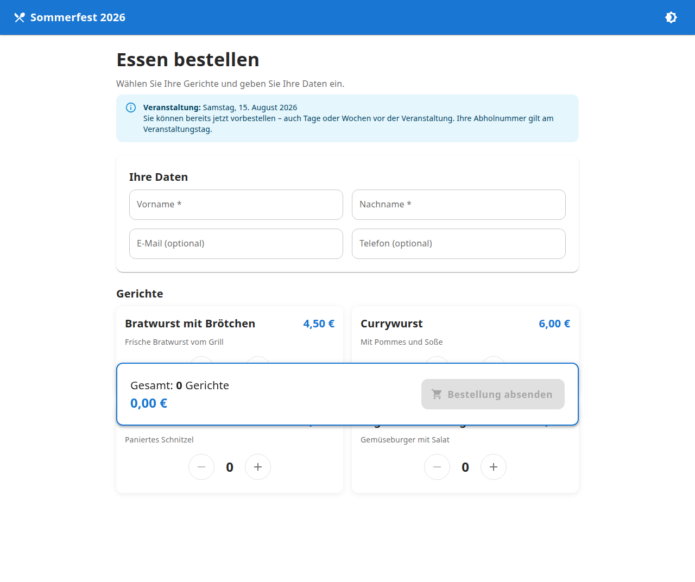
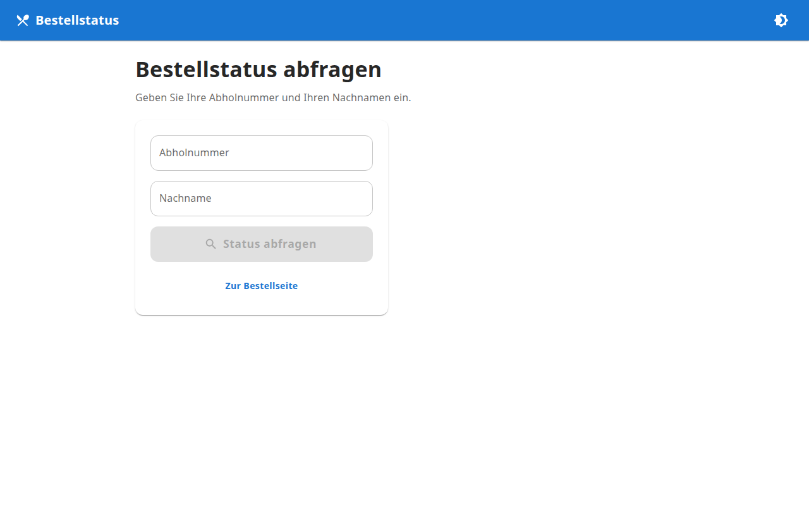

# Vereinsbestellung

Moderne Webanwendung zur Verwaltung von Essensbestellungen bei Vereinsveranstaltungen – mit Vorausbestellungen, Echtzeit-Updates und PWA-Unterstützung.



## Funktionen auf einen Blick

| Bereich | Beschreibung |
|---------|-------------|
| **Öffentliche Bestellseite** | Ohne Registrierung, Plus/Minus-Auswahl, Vorausbestellungen |
| **Kundenstatusseite** | Live-Status per WebSocket, Abfrage per Nummer + Nachname |
| **Abholboard** | Vollbild-Monitor für fertige Bestellungen |
| **Mitarbeiter-Dashboard** | Statistiken, Umsatz, beliebte Gerichte |
| **Küchenansicht** | Tablet-optimiert mit großen Buttons |
| **Kassenansicht** | Abholung per Tages-Bestellnummer |
| **Lokale Kasse** | Bestellungen vor Ort ohne Kundendaten |
| **Speisenverwaltung** | CRUD mit Bild-Upload (Admin) |
| **Veranstaltungsverwaltung** | Mehrere Events, eine aktiv (Admin) |

## Vorausbestellungen

Kunden können **Tage oder Wochen vor** der Veranstaltung bestellen. Die Abholnummer (001, 002, …) bezieht sich auf den **Veranstaltungstag**, nicht auf den Bestellzeitpunkt.

```
Kunde bestellt am 01.07. ──► Veranstaltung am 15.08.
                              Abholnummer: 042
                              Gültig am: 15.08.
```

Am Veranstaltungstag sieht die Küche alle Vorbestellungen – egal wann sie aufgegeben wurden.

## Screenshots

### Öffentlicher Bereich

| Bestellseite | Kundenstatus | Status-Abfrage |
|:---:|:---:|:---:|
|  |  |  |

### Monitore & Displays

| Abholboard (1920×1080) |
|:---:|
|  |

Das Abholboard unter `/abholboard` ist für Fernseher oder Monitore optimiert – große Schrift, automatische Aktualisierung, kein Login nötig.

### Mitarbeiterbereich

| Login | Dashboard | Küche (Tablet) |
|:---:|:---:|:---:|
|  |  |  |

| Kasse | Lokale Kasse | Bestellungen |
|:---:|:---:|:---:|
|  |  |  |

### Administration

| Speisenverwaltung | Veranstaltungen |
|:---:|:---:|
|  |  |

## Schnellstart

### Mit Docker (empfohlen)

```bash
git clone https://github.com/TimUx/food-order.git
cd food-order
cp .env.example .env
docker compose up --build -d
docker compose exec backend npm run seed
```

| Dienst | URL |
|--------|-----|
| Frontend | http://localhost:5173 |
| Backend API | http://localhost:3001/api |
| Abholboard | http://localhost:5173/abholboard |
| Mitarbeiter-Login | http://localhost:5173/mitarbeiter/login |

### Lokale Entwicklung

```bash
# Backend
cd backend && npm install
cp ../.env.example .env
npx prisma migrate deploy && npm run seed && npm run dev

# Frontend (neues Terminal)
cd frontend && npm install && npm run dev
```

## Test-Zugangsdaten

| Rolle | E-Mail | Passwort | Zugriff |
|-------|--------|----------|---------|
| Administrator | admin@verein.local | admin123 | Vollzugriff |
| Mitarbeiter (Küche) | kueche@verein.local | staff123 | Küche, Kasse, Bestellungen |

> Passwörter vor dem produktiven Einsatz ändern!

## Technologie-Stack

| Bereich | Technologie |
|---------|-------------|
| Frontend | React, TypeScript, Vite, Material UI, PWA |
| Backend | Node.js, Express, TypeScript |
| Datenbank | PostgreSQL |
| ORM | Prisma |
| Realtime | Socket.IO |
| Deployment | Docker Compose |

## Routen

### Öffentlich (kein Login)

| Route | Beschreibung |
|-------|-------------|
| `/` | Bestellseite mit Vorausbestellung |
| `/status` | Status abfragen (Abholnummer + Nachname) |
| `/status/:orderId` | Live-Status nach Bestellung |
| `/abholboard` | Öffentliches Abholboard für Monitore |

### Mitarbeiter (JWT)

| Route | Beschreibung | Rolle |
|-------|-------------|-------|
| `/mitarbeiter/login` | Anmeldung | – |
| `/mitarbeiter` | Dashboard | ADMIN, STAFF |
| `/mitarbeiter/kueche` | Küchenansicht | ADMIN, STAFF |
| `/mitarbeiter/kasse` | Kassenansicht | ADMIN, STAFF |
| `/mitarbeiter/lokale-kasse` | Lokale Kasse | ADMIN, STAFF |
| `/mitarbeiter/bestellungen` | Bestellübersicht | ADMIN, STAFF |
| `/mitarbeiter/speisen` | Speisenverwaltung | ADMIN |
| `/mitarbeiter/veranstaltungen` | Veranstaltungen | ADMIN |

## Statusablauf

```
Neu → In Bearbeitung → Fertig → Abgeholt
                         ↓
                    Storniert
```

Alle Statusänderungen werden per Socket.IO sofort synchronisiert (Küche, Dashboard, Kasse, Kundenstatus, Abholboard).

## Dokumentation

| Handbuch | Zielgruppe | Inhalt |
|----------|-----------|--------|
| [Developer Guide](docs/DEVELOPER_GUIDE.md) | Entwickler | Architektur, API, Deployment, Erweiterungen |
| [Admin Guide](docs/ADMIN_GUIDE.md) | Administratoren | Veranstaltungen, Speisen, Schalter, Checklisten |
| [User Guide](docs/USER_GUIDE.md) | Mitarbeiter | Küche, Kasse, Abholung, Tipps |

## Projektstruktur

```
food-order/
├── backend/          # Express API + Prisma + Socket.IO
├── frontend/         # React PWA
├── docs/
│   ├── screenshots/  # UI-Screenshots aller Ansichten
│   ├── DEVELOPER_GUIDE.md
│   ├── ADMIN_GUIDE.md
│   └── USER_GUIDE.md
├── scripts/          # Screenshot-Generator
└── docker-compose.yml
```

## Tests

```bash
cd backend && npm test
cd frontend && npm test
```

## Screenshots aktualisieren

```bash
cd frontend && npm run build
cd .. && npm run screenshots
```

## PWA

Die Anwendung ist als Progressive Web App installierbar:

- Android, iOS, Windows, macOS
- Offline-Unterstützung für geladene Seiten
- Automatische Updates via Service Worker
- App-Icon und Splashscreen

## E-Mail-Bestätigungen (optional)

```env
SMTP_HOST=smtp.example.com
SMTP_PORT=587
SMTP_USER=benutzer
SMTP_PASS=passwort
SMTP_FROM=noreply@ihr-verein.de
```

## Erweiterbarkeit

Vorbereitet für: QR-Codes, Bondruck, Zahlungsanbieter (PayPal, Stripe, SumUp), mehrere Küchen, Push-Benachrichtigungen, CSV-Export, Mehrsprachigkeit.

## Lizenz

Proprietär – Vereinsnutzung
