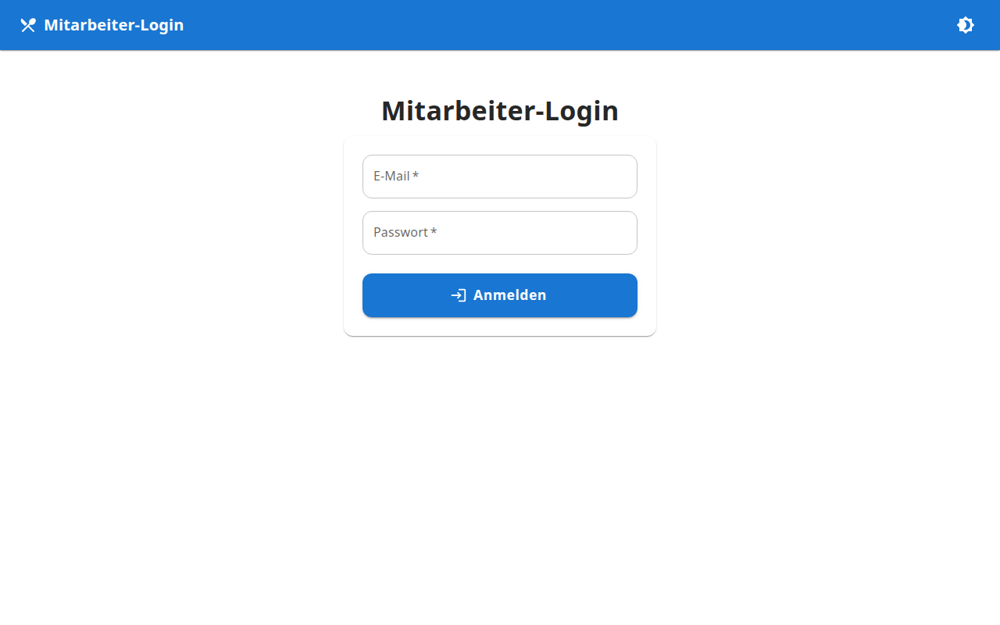
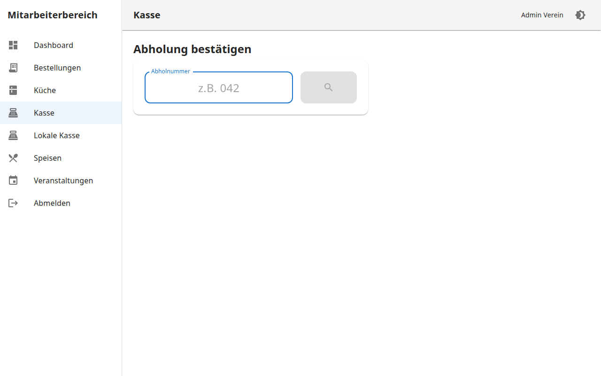
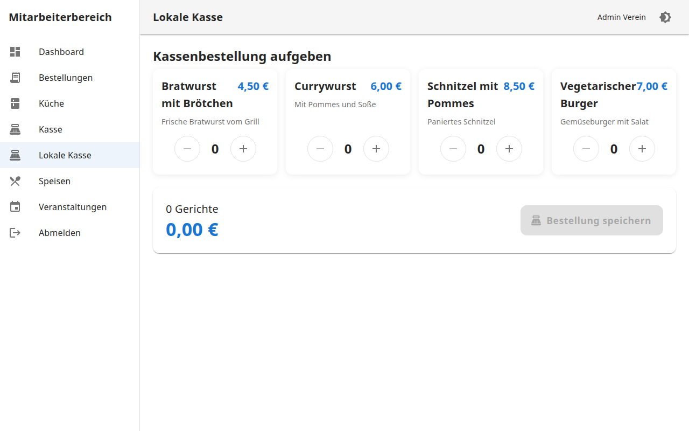
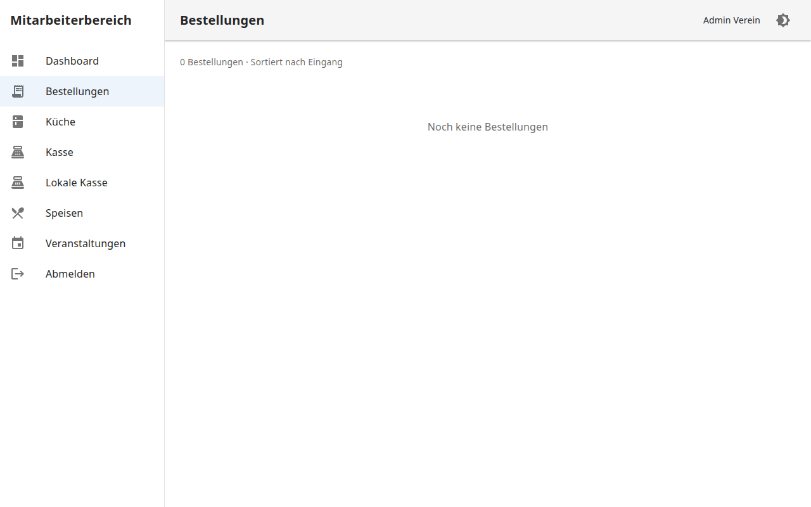

# Benutzerhandbuch (Mitarbeiter)

Anleitung für Mitarbeiter in Küche, Kasse und Service – ohne Administratorrechte.

## Inhaltsverzeichnis

1. [Anmeldung](#anmeldung)
2. [Übersicht der Bereiche](#übersicht-der-bereiche)
3. [Küchenansicht](#küchenansicht)
4. [Kassenansicht (Abholung)](#kassenansicht-abholung)
5. [Lokale Kasse](#lokale-kasse)
6. [Bestellungen verwalten](#bestellungen-verwalten)
7. [Vorausbestellungen am Event-Tag](#vorausbestellungen-am-event-tag)
8. [Tipps & häufige Fragen](#tipps--häufige-fragen)

---

## Anmeldung

1. Öffnen Sie die Adresse Ihres Vereins, z. B. `https://bestellung.ihr-verein.de/mitarbeiter/login`
2. Geben Sie E-Mail und Passwort ein
3. Tippen Sie auf **Anmelden**



**Test-Zugangsdaten (Demo):**

| Rolle | E-Mail | Passwort |
|-------|--------|----------|
| Küche | kueche@verein.local | staff123 |

> Die App kann als PWA auf dem Tablet installiert werden (Zum Startbildschirm hinzufügen).

---

## Übersicht der Bereiche

Nach der Anmeldung sehen Sie das **Dashboard** mit aktuellen Zahlen:


| Menüpunkt | Für wen | Aufgabe |
|-----------|---------|---------|
| Dashboard | Alle | Übersicht & Statistiken |
| Bestellungen | Alle | Alle Bestellungen einsehen |
| Küche | Küchenteam | Bestellungen bearbeiten |
| Kasse | Ausgabe | Abholung bestätigen |
| Lokale Kasse | Kasse vor Ort | Bestellung vor Ort aufgeben |

---

## Küchenansicht

**Adresse:** `/mitarbeiter/kueche`

Optimiert für Tablets mit großen Buttons.


### Ablauf

1. Neue Bestellungen erscheinen automatisch mit Status **Neu**
2. Tippen Sie **Bearbeitung starten** → Status wird *In Bearbeitung*
3. Wenn das Essen fertig ist: **Fertig** tippen → Status wird *Fertig*
4. Die Abholnummer erscheint auf dem öffentlichen Abholboard

### Filter

Standardmäßig werden nur **Neu** und **In Bearbeitung** angezeigt.

Optional einschaltbar:
- ☑ Fertig anzeigen
- ☑ Abgeholt anzeigen

### Wichtig

- Bestellungen werden **nach Eingang** sortiert (älteste zuerst)
- Jede Karte zeigt: Abholnummer, Uhrzeit, Gerichte mit Mengen
- Änderungen werden sofort an alle Geräte übertragen (kein manuelles Aktualisieren nötig)

---

## Kassenansicht (Abholung)

**Adresse:** `/mitarbeiter/kasse`



### Ablauf

1. Kunde nennt seine **Abholnummer** (z. B. „042")
2. Nummer eingeben und suchen
3. Bestellung wird angezeigt: Gerichte, Gesamtpreis, Status
4. Wenn Status **Fertig**: **Abholung bestätigen** tippen
5. Status wechselt zu *Abgeholt*, Nummer verschwindet vom Abholboard

### Hinweise

| Status | Was tun? |
|--------|----------|
| Fertig | Abholung bestätigen |
| In Bearbeitung | Kunde bitten zu warten |
| Abgeholt | Bereits ausgegeben |
| Neu | Noch nicht in der Küche |

---

## Lokale Kasse

**Adresse:** `/mitarbeiter/lokale-kasse`

Für Bestellungen **vor Ort** ohne Kundendaten (kein Name nötig).



### Ablauf

1. Gerichte per Plus/Minus auswählen
2. **Bestellung speichern** tippen
3. Die **Abholnummer** wird groß angezeigt
4. Nummer dem Kunden mitteilen oder anzeigen
5. **Nächste Bestellung** für den folgenden Kunden

---

## Bestellungen verwalten

**Adresse:** `/mitarbeiter/bestellungen`



Zeigt alle Bestellungen mit:
- Abholnummer und Uhrzeit
- Gerichte und Gesamtpreis
- Quelle (Online oder Kasse)
- Aktueller Status

### Status per Klick ändern

| Button | Neuer Status |
|--------|-------------|
| In Bearbeitung | Küche hat begonnen |
| Fertig | Bereit zur Abholung |
| Stornieren | Bestellung storniert |

---

## Vorausbestellungen am Event-Tag

Kunden können **Wochen vorher** online bestellen. Am Veranstaltungstag:

1. Alle Vorbestellungen erscheinen in der Küchenansicht
2. Die Abholnummer (z. B. 001) wurde bereits bei der Bestellung vergeben
3. Kunden können ihren Status unter `/status` verfolgen
4. Bei Abfrage mit **Abholnummer + Nachname** finden Kunden ihre Bestellung wieder

### Für Kunden wichtig

> *Bitte merken Sie sich unbedingt Ihre Abholnummer oder zeigen Sie diese später an der Kasse vor.*


---

## Tipps & häufige Fragen

### Die Küche zeigt keine neuen Bestellungen?

- Internetverbindung prüfen
- Seite neu laden
- Admin fragen, ob die richtige Veranstaltung aktiv ist

### Kunde hat Abholnummer vergessen?

- Kunde kann unter `/status` mit **Abholnummer + Nachname** nachschauen
- Oder in der Bestellübersicht nach dem Namen suchen

### Hell- oder Dunkelmodus?

Tippen Sie oben rechts auf das Sonnen/Mond-Symbol.

### App installieren (Tablet)

**Android:** Menü → „Zum Startbildschirm hinzufügen"
**iOS:** Teilen → „Zum Home-Bildschirm"

### Abholboard für Gäste

Separater Monitor unter `/abholboard` – kein Login nötig.


---

## Kurzreferenz Statusablauf

```
Neu  →  In Bearbeitung  →  Fertig  →  Abgeholt
                              ↓
                         Storniert
```

| Status | Bedeutung für Kunden |
|--------|---------------------|
| Neu | Bestellung eingegangen |
| In Bearbeitung | Wird zubereitet |
| Fertig | Abholbereit – Nummer auf dem Board |
| Abgeholt | Essen wurde ausgegeben |

---

Weitere Informationen für Administratoren: [Admin Guide](ADMIN_GUIDE.md)
