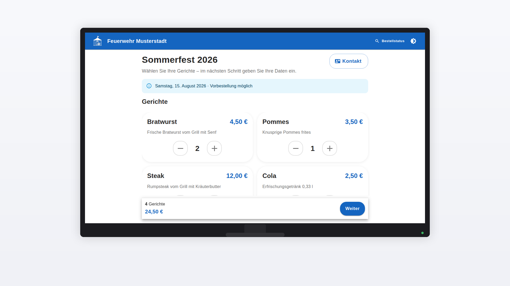
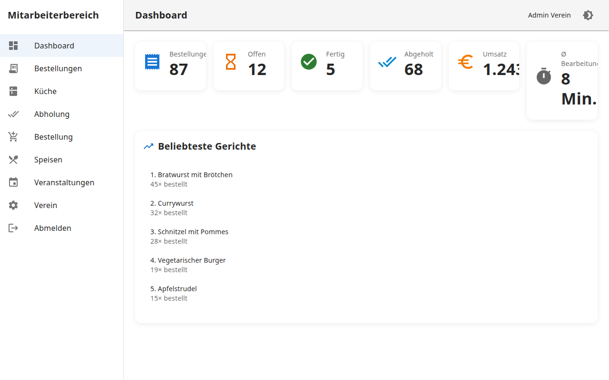
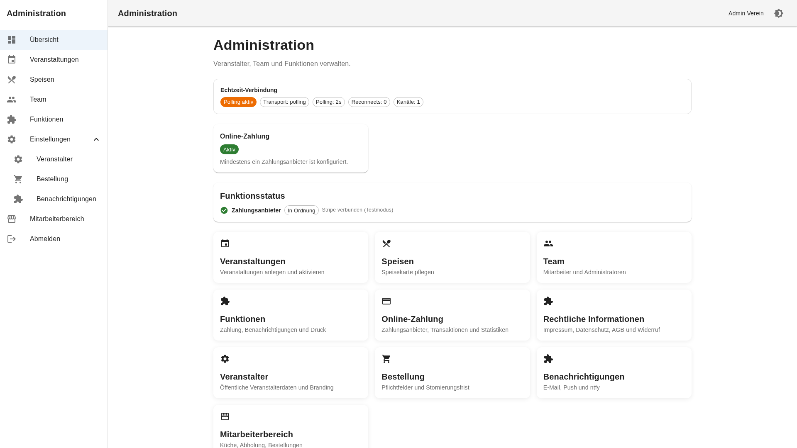
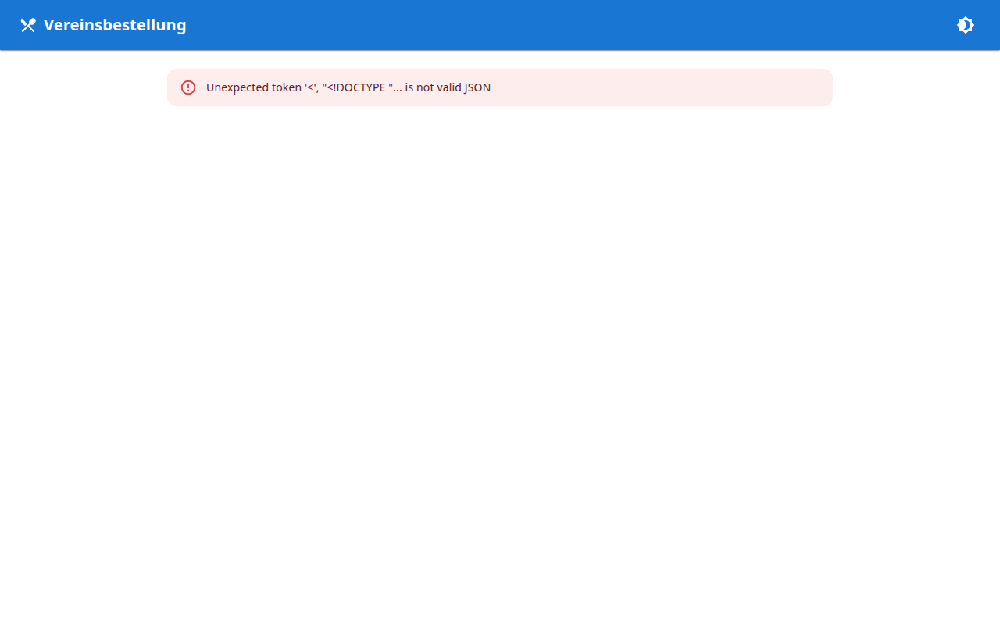
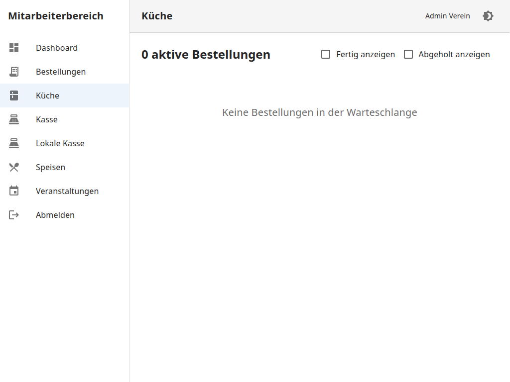
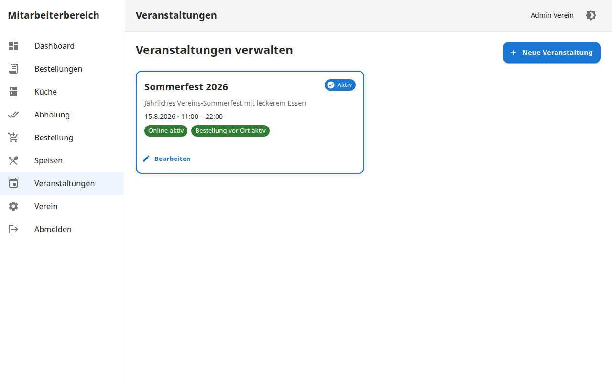
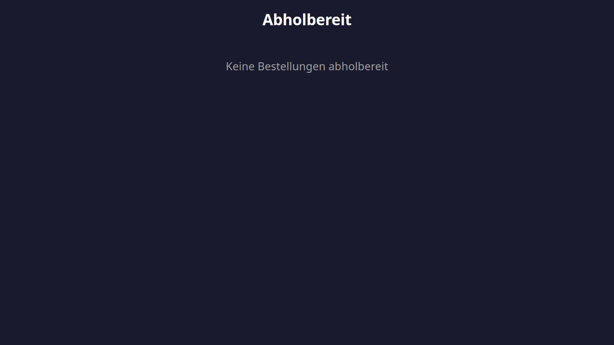
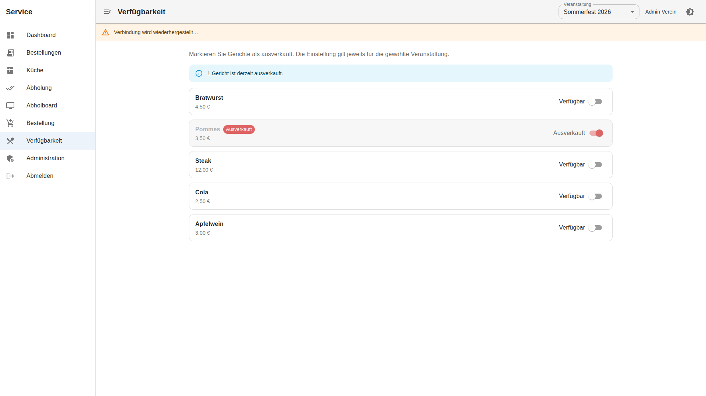
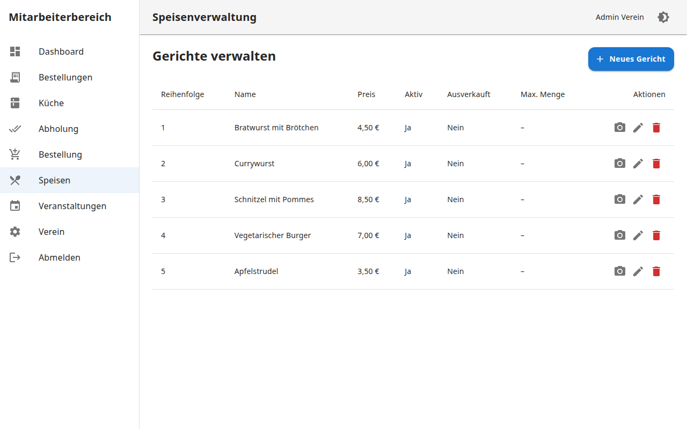

# Screenshots

UI-Vorschau (Light Theme, Beispieldaten *Feuerwehr Musterstadt*).

Die wichtigsten Ansichten sind auch in der [README](../README.md) eingebunden.

## Galerie

| Öffentlich | Service | Admin |
|:---:|:---:|:---:|
|  |  |  |
|  |  |  |
|  |  |  |

## Dateiliste

| Datei | Ansicht |
|-------|---------|
| `01-bestellseite-*.png` | Öffentliche Bestellseite (Monitor / iPhone / iPad) |
| `02`–`03` | Kundenstatus |
| `04` | Abholboard |
| `05` | Service-Login |
| `06`–`10` | Service: Dashboard, Küche, Abholung, Bestellung, Bestellungen |
| `11`–`20` | Admin: Katalog, Events, Verein, Kontakt, Login, Übersicht, Team, Bestellung, Benachrichtigungen, Funktionen |
| `21`–`22`, `29` | Payment: Übersicht, Einstellungen, Zahlungsarten |
| `23`–`25`, `30` | Legal: Übersicht, Seiten, Impressum, Einstellungen |
| `26` | Service: Verfügbarkeit |
| `27` | Admin: Mein Profil |
| `28` | Einrichtungsassistent |

## Neu erzeugen

```bash
cd frontend && npm run build
cd .. && npm install
npm run screenshots
```

Die für die Landingpage benötigten Dateien werden nach `frontend/public/screenshots/` kopiert.

Details: [Developer Guide — Screenshots](../DEVELOPER_GUIDE.md#screenshots-generieren).
