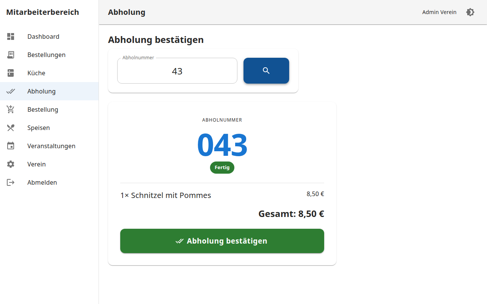

# Screenshots

Aktuelle UI-Vorschau (Light Theme, Beispieldaten *Feuerwehr Musterstadt*).

## Öffentlich & Gäste

| Bestellseite | Kundenstatus | Abholboard |
|:---:|:---:|:---:|
|  |  |  |

## Mitarbeiter

| Dashboard | Küche | Abholung |
|:---:|:---:|:---:|
|  |  |  |

## Administration

| Übersicht | Veranstaltungen | Speisen |
|:---:|:---:|:---:|
|  |  |  |

Weitere Dateien: `01`–`25` in diesem Ordner.

## Neu erzeugen

```bash
cd frontend && npm run build
cd .. && npm install
npm run screenshots
```

Details: [Developer Guide — Screenshots](../DEVELOPER_GUIDE.md#screenshots-generieren).
