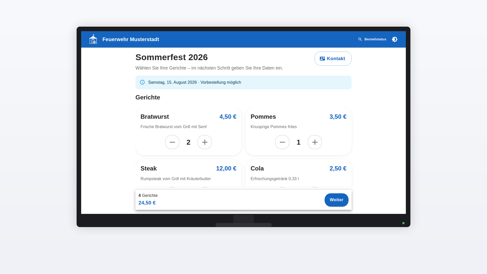
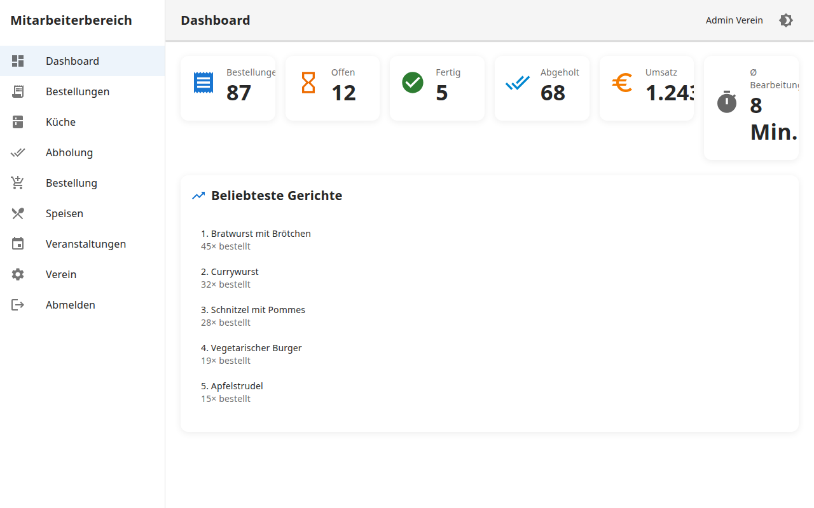
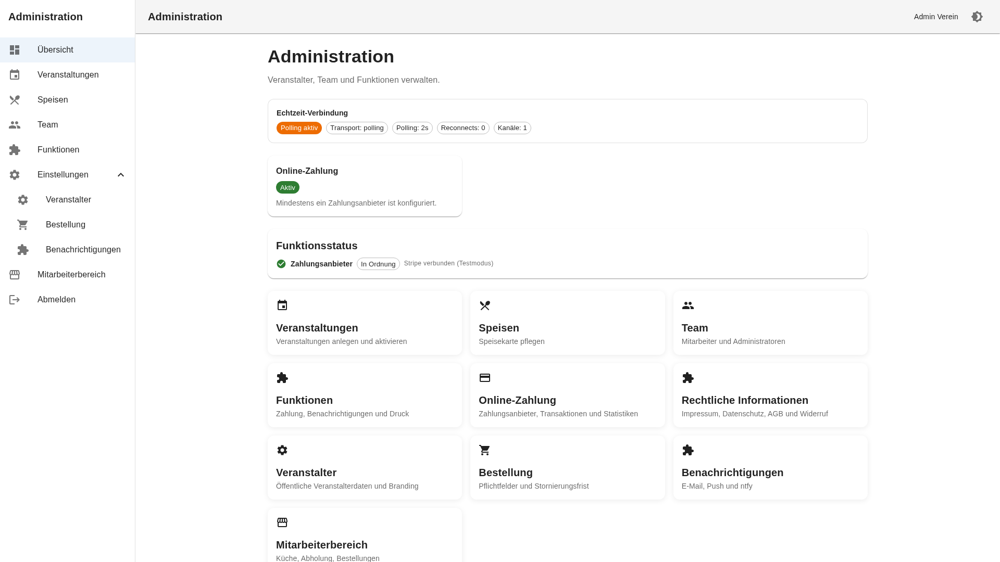
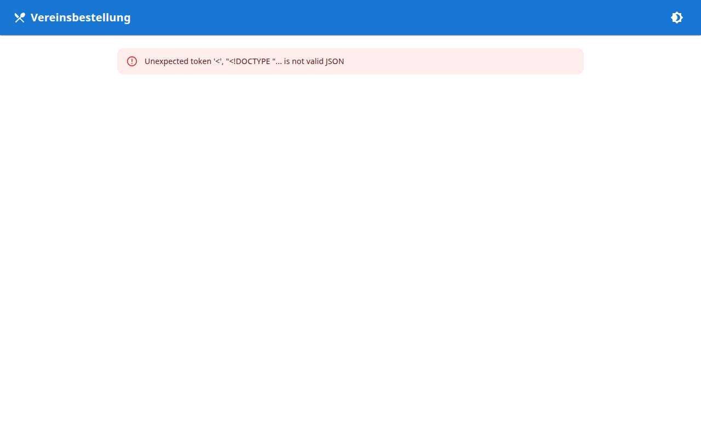
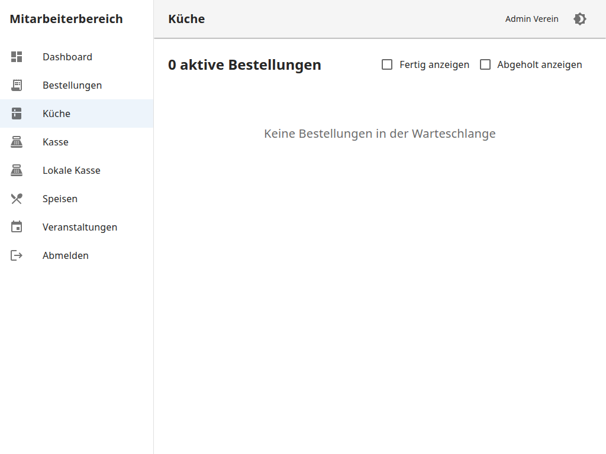
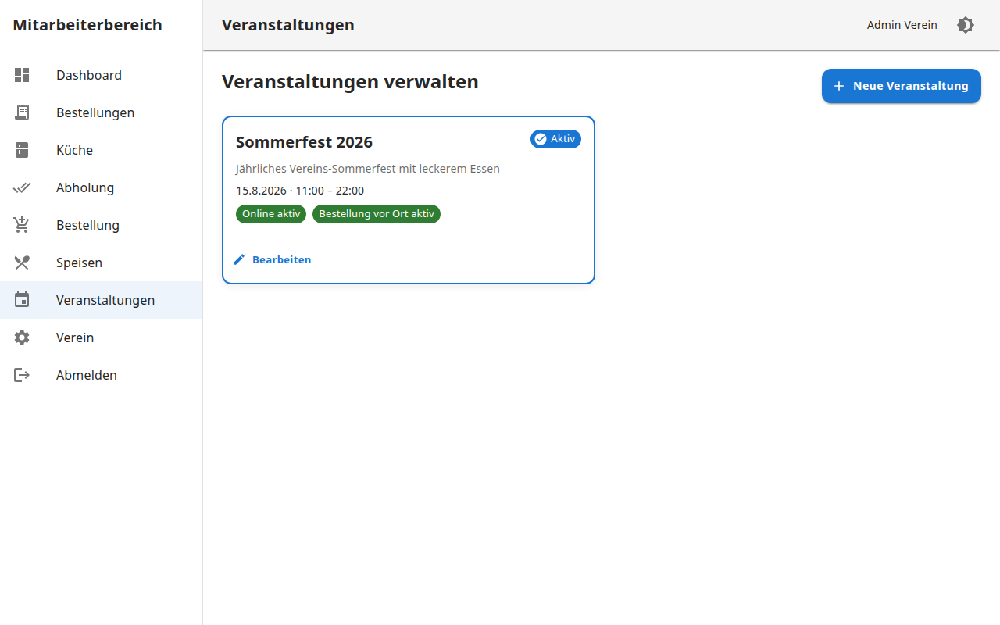
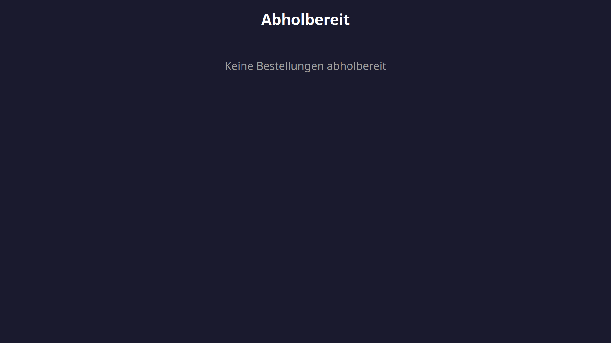
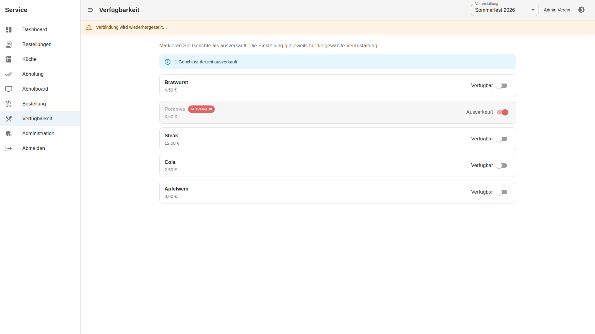
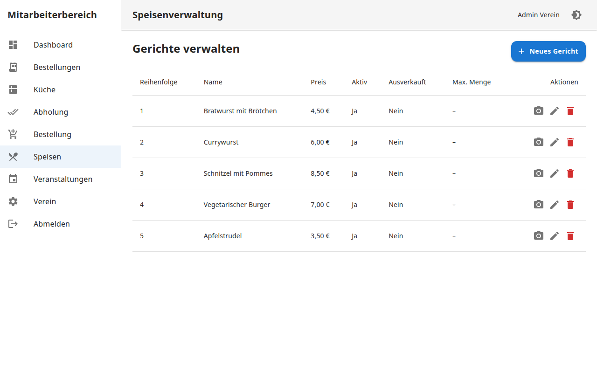

# Screenshots

UI-Vorschau (Light Theme, Beispieldaten *Feuerwehr Musterstadt*).
Die Screenshots sind keine Live-Daten und enthalten keine produktiven Zugangsdaten.

Die wichtigsten Ansichten sind auch in der [README](../README.md) eingebunden.

## Galerie

| Öffentlich | Service | Administration |
|:---:|:---:|:---:|
|  |  |  |
|  |  |  |
|  |  |  |

## Dateiliste

| Datei | Ansicht |
|-------|---------|
| `01-bestellseite-*.png` | Öffentliche Bestellseite (Monitor / iPhone / iPad) |
| `02`–`03` | Kundenstatus |
| `04` | Abholboard |
| `05` | Service-Login |
| `06`–`10` | Service: Dashboard, Küche, Abholung, Bestellung, Bestellungen |
| `11`–`20` | Admin: Katalog, Events, Verein, Kontakt, Login, Übersicht, Team, Bestellung, Benachrichtigungen, Funktionen |
| `21`–`22`, `29` | Payment: Übersicht, Einstellungen, Zahlungsarten |
| `23`–`25`, `30` | Legal: Übersicht, Seiten, Impressum, Einstellungen |
| `26` | Service: Verfügbarkeit |
| `27` | Admin: Mein Profil |
| `28` | Einrichtungsassistent |

## Rollen und typische Geräte

| Arbeitsbereich | Typisches Gerät | Wichtigste Aufgabe |
|----------------|-----------------|--------------------|
| Öffentliche Bestellseite | Smartphone, Tablet | Speisen auswählen und Bestellung absenden |
| Küche | Tablet/Monitor | Neue Bestellungen priorisieren und Status setzen |
| Abholung | Monitor/Tablet | Fertige Bestellungen schnell auffinden |
| Kasse | Tablet/Kassensystem | Vor-Ort-Bestellungen und Zahlungen erfassen |
| Administration | Desktop/Tablet | Veranstaltungen, Katalog, Team und Module verwalten |

Bei der Bedienung unter Zeitdruck sind insbesondere die Screenshots `07`, `08`, `09`
und `04` relevant. Reconnect-/Offline-Hinweise werden dynamisch eingeblendet und sind
deshalb nicht in jeder statischen Aufnahme sichtbar.

## Neu erzeugen und prüfen

```bash
cd frontend && npm run build
cd .. && npm install
npm run screenshots
```

Der Generator baut zunächst Frontend und Backend-Testumgebung, nimmt die Ansichten mit
Playwright auf und kopiert die für die Landingpage benötigten Dateien nach
`frontend/public/screenshots/`. Vor einem Commit bitte prüfen:

1. Sind alle in dieser Galerie verlinkten Dateien vorhanden?
2. Sind keine echten Namen, E-Mail-Adressen, Tokens oder Zahlungsdaten sichtbar?
3. Stimmen Light/Dark-Theme, mobile Ansichten und Rollenbezeichnungen mit der aktuellen UI überein?
4. Wurde bei UI-Änderungen auch die Galerie und die passende Anleitung aktualisiert?

Details: [Developer Guide — Screenshots](../DEVELOPER_GUIDE.md#screenshots-generieren).
